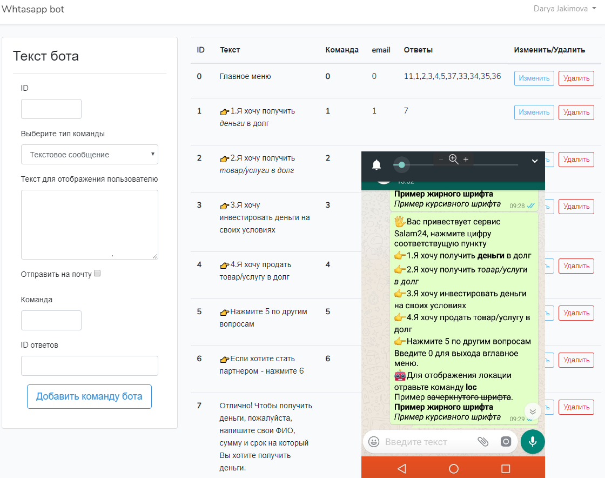

# whatsappbot
whatsapp laravel for chat-api

Возможности бота:
1) Автоматизация ответов бота, т.е. пользователь через интерфейс вводит возможные команды и ответы;
2) Отправка писем на почту, указанную в админке или спец файле;
3) Таблица полученных сообщений
4) Выгрузка сообщений в email, сортировка и поиск сообщений
5) Простое развертывание приложения на хостинге(разархивировать архив и изменить один файл с личными данными(имя бд, пароли, почтовые адреса))
6) Гарантия роботоспособности в рамках ТЗ в течении 1 мес.